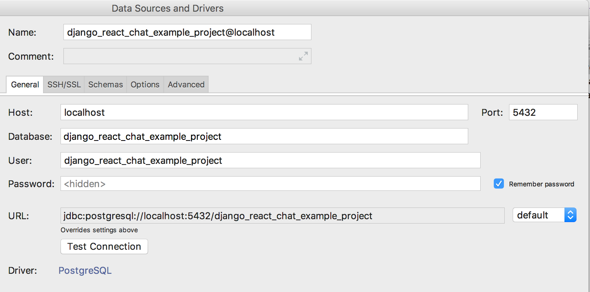
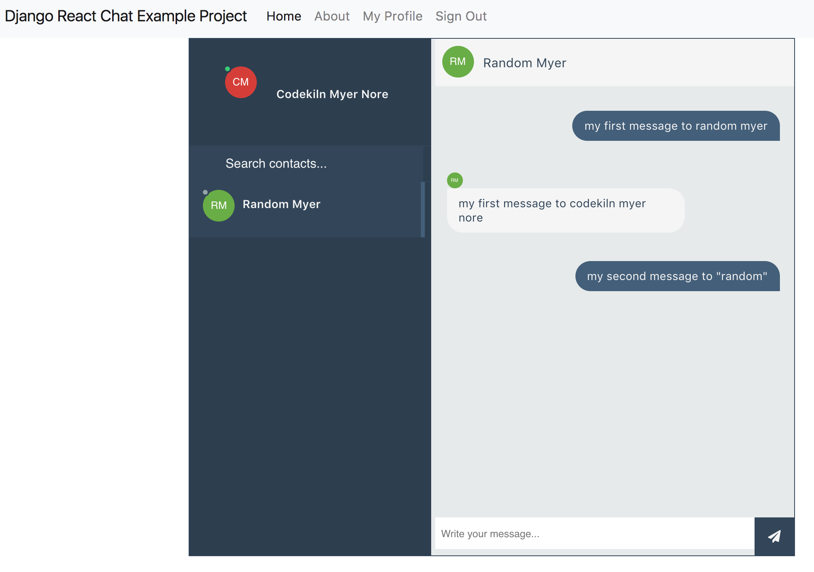

Django React Chat Example Project
=================================

An example project showing a chat app with Django Channels, 
Webpack, React and Docker.

## Assumptions
1. Unix shell commands are given below. 
   Windows likely will need some work but is left as an exercise to the 
   user.

## Prerequisites
1. Install Docker for your system so that `docker-compose` and `docker`
   are available from the command line.   
2. Install `yarn` package manager. `npm` likely works, too but was
   not tested.

## Installation
1. `yarn install` - install the javascript packages
2. `yarn dev` - start generating the webpack bundle
3. `docker-compose -f local.yml build` - compile the Docker Images,
   using the docker-compose file at `local.yml`. 
   - This may take some time, especially if this is the first time you 
     have used docker with python.
   - This runs a pip install when compiling the docker image. 
4. `docker-compose -f local.yml up` - Run the compiled docker images.
5. configure a postgres client
   - in pycharm, I use a Postgres Database connection:  
   - the password is blank
   - the username and database are both 
     `django_react_chat_example_project`
   - 
5. run http://localhost:8000/ in your web browser
   - create two users using the sign up process
   - using postgres client, open the 
     `django_react_chat_example_project.public.account_emailaddress`
     table. Set the `verified` bit to true and confirm.
     - optional: you can also do this from the command line client using 
       `docker-compose -f local.yml run postgres`, but this is left 
       as an exercise for the user
   - go to `http://localhost:8000/chat/` signed in as both users
   - chat!
   - 
   

## Useful commands
* `$ docker-compose -f local.yml run django python manage.py migrate`
  * `./manage.py migrate` is called during 
    `docker-compose -f local.yml up`, but useful to know anyway

